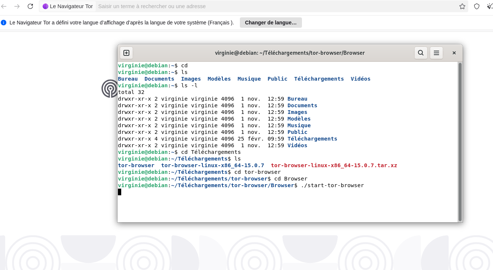
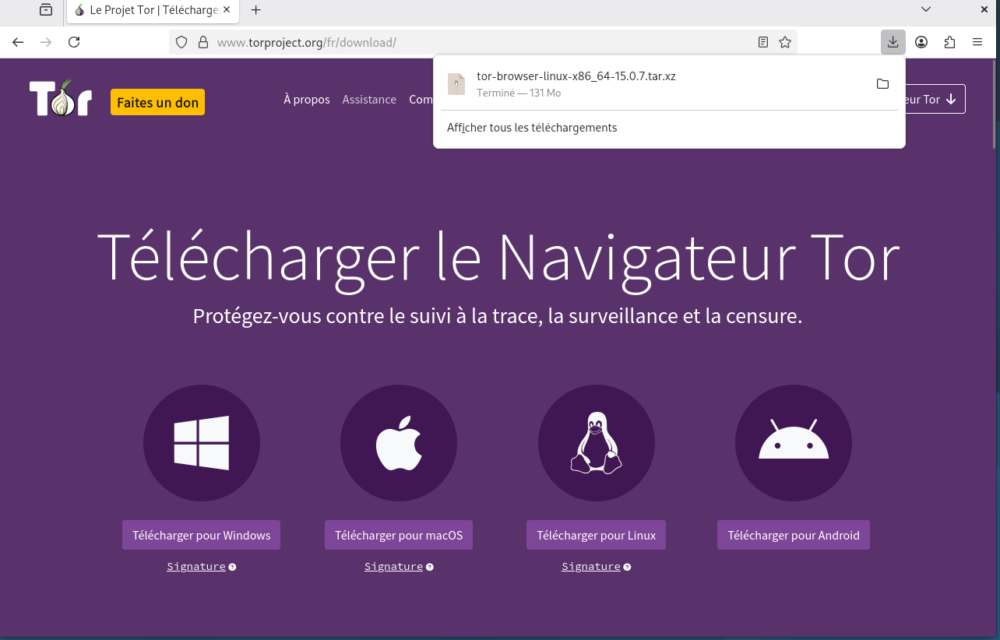
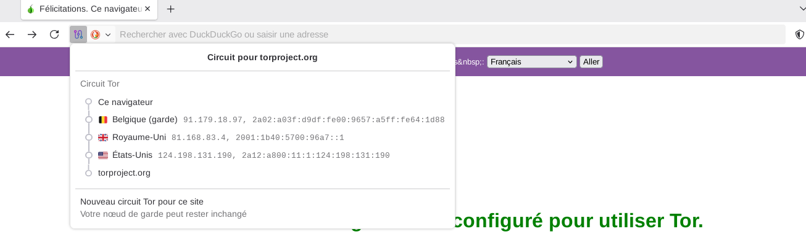
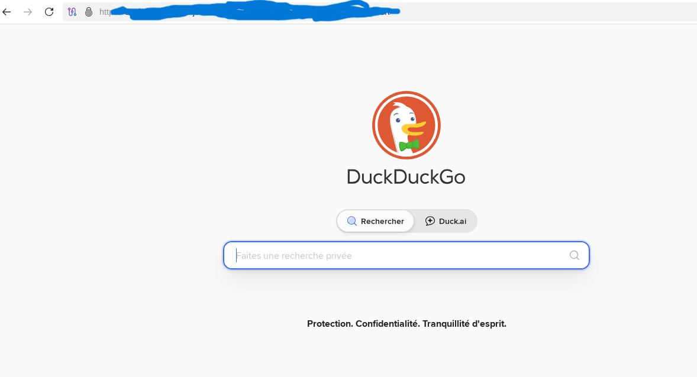
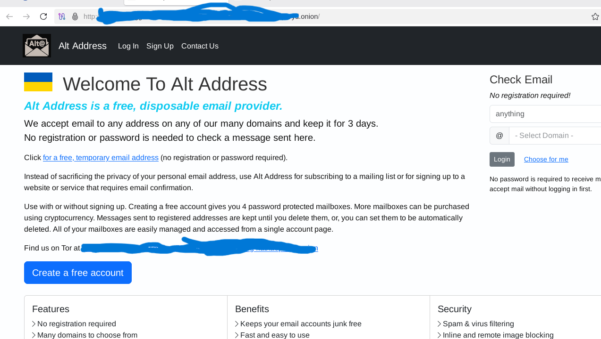
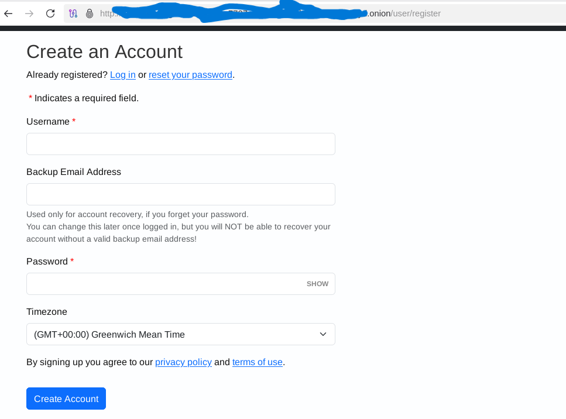
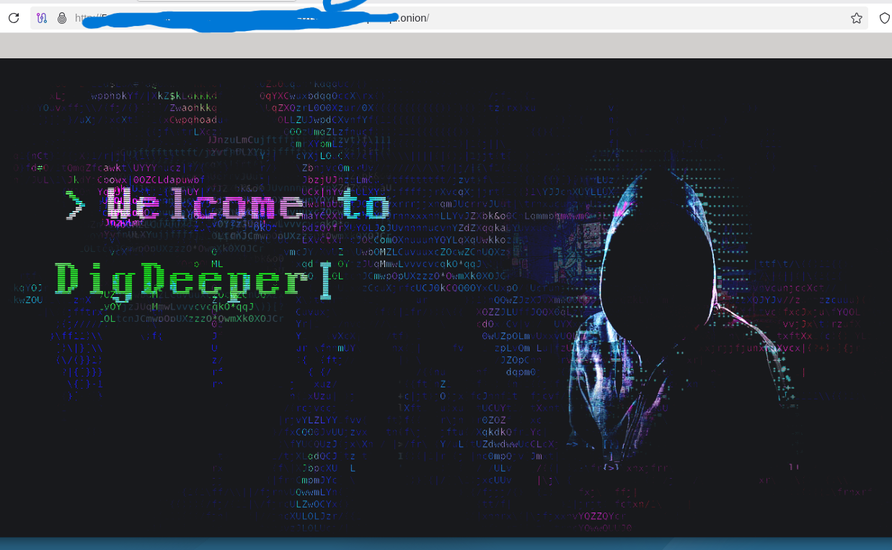

<h1 align="center">🌐 Dark Web - Analyse de sécurité d'un service .onion via Tor</h1>

  

  © 2026 Virginie Lechene - Tous droits réservés 
  Reproduction interdite sans autorisation préalable. 
  Usage pédagogique uniquement.

---

## 📌 Description du projet

Ce projet présente une analyse de sécurité d’un service accessible via le réseau Tor (.onion), réalisée dans un environnement virtualisé et isolé.

L’objectif n’était pas d’interagir avec le service, mais de :

- Comprendre le fonctionnement de l’accès aux services .onion
- Appliquer une méthodologie de cybersécurité rigoureuse
- Documenter chaque étape de manière structurée
- Analyser les risques associés à la navigation sur le Dark Web

Aucune donnée personnelle n’a été saisie.  
Aucun téléchargement n’a été effectué.

---

## Objectifs pédagogiques

- Comprendre le fonctionnement du réseau Tor  
- Mettre en place un environnement d’analyse sécurisé  
- Étudier le comportement d’un service .onion  
- Identifier les risques techniques associés  
- Documenter une démarche d’investigation responsable  

---

## Clarification : Dark Web et légalité

Le Dark Web ne désigne pas une activité illégale en soi.
Il s’agit d’un ensemble de services accessibles via des réseaux anonymisants comme Tor, utilisant majoritairement des adresses en .onion. Toutefois, tous les services du Dark Web ne reposent pas exclusivement sur ce format. D’autres réseaux anonymes existent, tels que I2P ou Freenet.

Le Dark Web peut contenir :

- Des services légitimes (journalisme, lanceurs d’alerte, protection de la vie privée)
- Des outils de sécurité et d’anonymisation
- Des forums communautaires
- Des plateformes de communication protégées

Cependant, comme tout espace numérique anonyme, il peut également
être utilisé à des fins illégales.

Ainsi, l’illégalité ne provient pas du réseau Tor ou du Dark Web en lui-même,
mais de l’usage qui en est fait.

---

## Accès au Dark Web

L’accès au Dark Web nécessite l’utilisation d’un réseau anonymisant, tel que Tor.”
L’accès au Dark Web nécessite l’utilisation d’un réseau anonymisant,
comme le réseau tel que Tor.

Les services hébergés sur le réseau Tor utilisent des adresses spécifiques
se terminant par l’extension ".onion".

Ces adresses ne sont pas accessibles depuis un navigateur classique
(Chrome, Edge, Firefox standard) et nécessitent l’utilisation
du navigateur Tor pour être consultées.

L’accès aux services en .onion indique l’utilisation du réseau Tor, permettant d’accéder à des services du Dark Web.

---- 

## Sécurisation de l’environnement

<h2 align="center">🔐 Architecture de sécurisation</h2>

<table align="center">
<tr>
<th style="background-color:#2E8B57;color:white;">🖥️ Machine Hôte (Windows)</th>
<th style="background-color:#1E90FF;color:white;">💻 Machine Virtuelle (Debian 13)</th>
<th style="background-color:#6A5ACD;color:white;">🌐 Réseau</th>
<th style="background-color:#8B4513;color:white;">🧅 Service</th>
</tr>

<tr>
<td>

🟢 VPN Proton actif  
 🟢 Aucune donnée sensible  
 🟢 Pas d’activité parallèle  

</td>

<td>

🟢 Réseau NAT  
 🟢 Aucun dossier partagé  
 🟢 Presse-papiers désactivé  
 🟢 Glisser-déposer OFF  
 🟢 Aucun USB monté  
 🟢 Snapshot avant navigation  
 🟢 Aucune donnée personnelle  

</td>

<td align="center">

Tor Network  

</td>

<td align="center">

Service .onion  

</td>

</tr>
</table>

## ⚙️ Installation de Tor Browser

### Méthode manuelle

  

<pre>
wget https://www.torproject.org/dist/torbrowser/linux/tor-browser-linux64-*.tar.xz
tar -xf tor-browser-linux64-*.tar.xz
cd tor-browser
./start-tor-browser.desktop
</pre>

  

----

## Fonctionnement du circuit Tor

Lorsque l’utilisateur se connecte à un service .onion,
le trafic est routé à travers plusieurs relais (nœuds)
afin de préserver l’anonymat.

Le circuit Tor est composé généralement de :
- Un nœud d’entrée (Guard Node)
- Un relais intermédiaire
- Un nœud de sortie (dans le cas d’un site classique)

  

---

## 🌍 Accès aux services .onion

1️⃣ Connexion via Tor Browser   
	•	Connexion au réseau Tor   
	•	Vérification du circuit Tor   
	•	Observation des nœuds (garde, relais, sortie)   

2️⃣ Utilisation d’un moteur de recherche .onion   
	•	Accès à la version .onion de DuckDuckGo   
	•	Recherche via mots-clés liés aux services Dark Web   
	•	Consultation d’articles référençant des services .onion   
	•	Ouverture directe d’un service identifié   

----

 ## 🟢Service analysé   

Service d’e-mail temporaire accessible via Tor.   

Caractéristiques observées :   
	•	Interface minimaliste    
	•	Création de compte possible   
	•	Aucune vérification d’identité   
	•	Conservation des messages limitée   
	•	Fonctionnement basé sur l’anonymat   

Aucune interaction sensible n’a été réalisée.

  

  

## ⚠ Analyse de risque

Risques identifiés :   
	•	Collecte potentielle de métadonnées    
	•	Exploitation JavaScript   
	•	Faux miroir .onion   
	•	Tracking de session   
	•	Téléchargement de fichiers malveillants   

Décision : arrêt volontaire avant toute interaction ou saisie de données.

---

### Exemple d’accès à un lien .onion

La capture ci-dessous illustre l’accès à un service via une adresse en `.onion`, accessible uniquement à travers le réseau Tor.

Les services `.onion` ne sont pas indexés par les moteurs de recherche classiques et nécessitent l’utilisation de Tor Browser.

### Risques potentiels associés

L’accès à un lien `.onion` inconnu peut présenter plusieurs risques :

- Absence d’identification claire de l’opérateur du service
- Présence possible de contenus malveillants
- Risques de phishing ou de collecte de données
- Téléchargement potentiel de fichiers infectés
- Exposition à des contenus illicites

## ⚠️ Recommandations de sécurité

- D’utiliser un environnement isolé (machine virtuelle)
- De ne pas interagir avec des formulaires sensibles
- De ne télécharger aucun fichier
- De ne divulguer aucune donnée personnelle
  

Cette analyse a été réalisée dans un environnement contrôlé et observationnel.
Il ne s’agit pas d’une action intrusive, mais d’une consultation passive et encadrée.  

  

---

📸 Les captures documentent   

🟢 Installation de Tor   
🟢 Paramétrage du niveau de sécurité   
🟢 Visualisation du circuit Tor   
🟢 Accès au moteur de recherche .onion   
🟢 Interface du service analysé   
🟢 Analyse du formulaire d’inscription   

---  

🔒 Note éthique  

Les adresses .onion ont été volontairement masquées dans les captures d’écran.   

Ce choix repose sur une démarche éthique en cybersécurité visant à :   

- Ne pas diffuser d’adresses sensibles   
- Ne pas faciliter l’accès direct aux services analysés   
- Respecter une démarche responsable et professionnelle
     
🔎 Note complémentaire :
Les services .onion analysés ne sont pas indexés par les moteurs de recherche traditionnels et nécessitent la connaissance explicite de l’adresse pour y accéder. 
Ils circulent généralement via des répertoires spécialisés, des forums privés ou des partages restreints.

---

📈 Axes d’amélioration futurs   

Ce projet pourrait être approfondi par :   

- Une analyse plus détaillée du trafic réseau  
- Une étude comparative de plusieurs services .onion   
- Une inspection approfondie des certificats et mécanismes de sécurité  
- Une analyse des configurations avancées du navigateur Tor  

---  

🎓 Objectifs pédagogiques

Ce projet démontre :

- Compréhension du réseau Tor  
- Mise en place d’un environnement isolé  
- Analyse de risque structurée  
- Démarche éthique et responsable

---

✍️ Auteur : *Virginie Lechene*

---

## ⚖ Disclaimer

Ce projet est réalisé à des fins éducatives et d’analyse en cybersécurité uniquement.
Il ne constitue en aucun cas une incitation à l’utilisation de services illicites.
L’auteure décline toute responsabilité en cas d’usage inapproprié des informations présentées.

